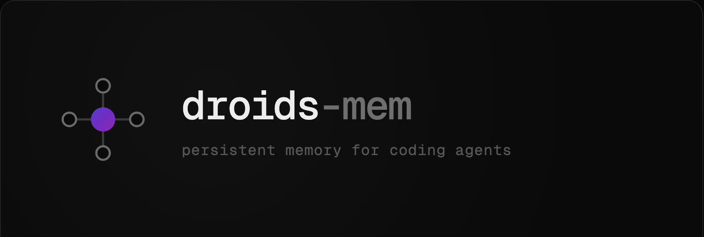
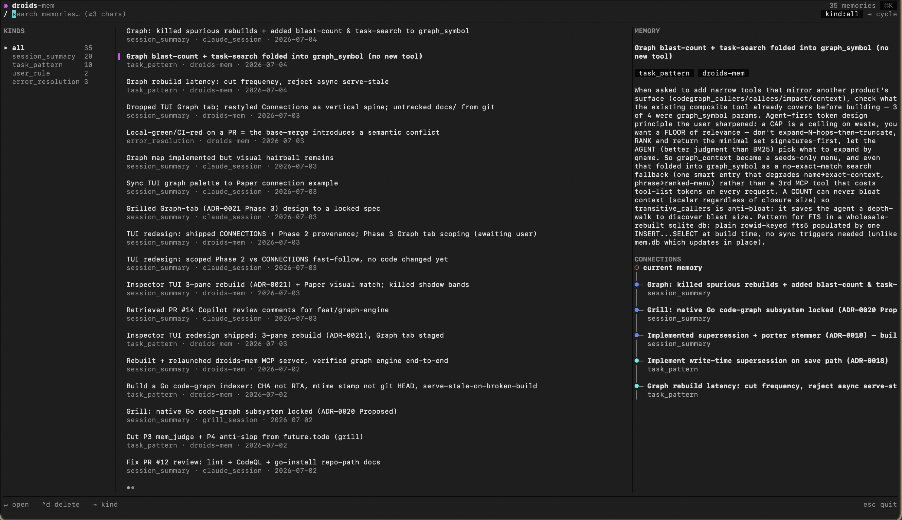

<!-- markdownlint-disable MD041
```text
                ████▒  █████   ▓██▓  █████  ████▒   ▓███▒        █▒  ▒█ ██████ █▒  ▒█
                █  ▒█░ █   ▓█ ▒█  █▒   █    █  ▒█░ █▓  ░█        ██  ██ █      ██  ██
                █   ▒█ █    █ █░  ░█   █    █   ▒█ █             ██░░██ █      ██░░██
                █    █ █   ▒█ █    █   █    █    █ █▓░           █▒▓▓▒█ █      █▒▓▓▒█
                █    █ █████  █    █   █    █    █  ▓██▓         █ ██ █ ██████ █ ██ █
                █    █ █  ░█▒ █    █   █    █    █     ▓█  ███   █ █▓ █ █      █ █▓ █
                █   ▒█ █   ░█ █░  ░█   █    █   ▒█      █        █    █ █      █    █
                █  ▒█░ █    █ ▒█  █▒   █    █  ▒█░ █░  ▓█        █    █ █      █    █
                ████▒  █    ▒  ▓██▓  █████  ████▒  ▒████░        █    █ ██████ █    █
                                                    
``` -->



# droids-mem

**Persistent memory for AI agents.** One Go binary, one SQLite database, zero
external services. A CLI for humans and an MCP bridge for agents share the same
store, so a lesson an agent learns in one session is there at the start of the
next.

- **Memory** — agents save structured lessons (session summaries, task
  patterns, error resolutions, user rules); droids-mem scrubs secrets,
  deduplicates, and replays the relevant ones at the start of the next run.
- **Code graph** — for Go repos, a per-repo symbol + call-edge index answers
  "what calls X / what does X call" in one query, signatures-first.
- **TUI** — a terminal browser to read and prune the corpus by hand.

Everything lives in `~/.droids-mem/`. No daemon to babysit — the MCP bridge
spawns on demand.

---

## Install

```
go install github.com/samuelmolero26/droids-mem/cmd/droids-mem@latest
```

Requires Go 1.25+. Pure-Go (`modernc.org/sqlite`) — builds without CGO.

Or grab a prebuilt binary for `linux/{amd64,arm64}` and `darwin/{amd64,arm64}`
from the [Releases page](https://github.com/SamuelMolero26/droids-mem/releases),
or build from source:

```
git clone https://github.com/SamuelMolero26/droids-mem
cd droids-mem && go build ./cmd/droids-mem
./droids-mem --version
```

---

## Quick start

```
# Save a lesson
droids-mem save \
  --task-type "go-backend" \
  --kind error_resolution \
  --title "modernc sqlite returns Error code 5 on FTS5 trigger rebuild" \
  --what "memories_fts rebuild in same txn as ALTER TABLE deadlocked" \
  --learned "DROP + INSERT-SELECT must run after the parent ALTER commits"

# Search
droids-mem search --query "fts5 rebuild" --limit 5

# Load context at the start of a run
droids-mem context --task-type "go-backend"

# Browse the corpus interactively
droids-mem tui
```

All output is JSON on stdout; errors are JSON on stderr. Exit codes: `0` ok,
`1` runtime, `2` usage, `3` not found, `5` conflict/duplicate, `10` dry-run.

---

## TUI

A three-pane terminal browser over the local corpus — **KINDS** sidebar, a
memory list, and a detail pane that follows the cursor. Type to live-search
(≥3 chars), `tab` cycles pane focus, `ctrl+d` deletes with confirmation, `esc`
backs out. A **CONNECTIONS** view surfaces how memories link to each other and
to the files they came from.

```
droids-mem tui◊
```

<!-- Drop a screenshot at assets/tui.png -->


---

## Use with Claude Code

Two layers, each usable on its own:

1. **MCP tools** — the agent reads and writes memory on demand.
2. **Session memory** — a memory is recorded automatically at the end of every
   session, and relevant prior memories are injected when you start related
   work, via native Claude Code hooks (no shell scripts, no `jq`).

### One-shot setup

```
droids-mem install --all
```

Idempotent. Merges the hooks into `~/.claude/settings.json`, starts the MCP
bridge, registers it with the Claude Code CLI (`claude mcp add`), and appends a
guidance block to `~/.claude/CLAUDE.md`. A missing `claude` CLI degrades to a
printed manual instruction instead of failing.

### Manual setup

```
# Start the local MCP bridge (spawns a detached server if down)
droids-mem ensure-server

# Register it with Claude Code
claude mcp add --transport http droids-mem http://127.0.0.1:7777/mcp \
  --header "Authorization: Bearer $(tr -d '\n' < ~/.droids-mem/token)"

# Wire the session-memory hooks (add --project to target ./.claude)
droids-mem install
```

`droids-mem session hook` reads each hook's JSON on stdin and dispatches:

| Claude Code event | Behaviour |
|-------------------|-----------|
| `PostToolUse` | count meaningful changes (intake gate) |
| `Stop` | once enough work is unstaged, ask the model to record progress |
| `SessionEnd` | save the staged summary if the gate passes |
| `SessionStart` | start the MCP bridge if down; recover crashed-run summaries |
| `UserPromptSubmit` | inject relevant prior memories for the prompt |

Every hook **fails open** — a memory hiccup never breaks your session. Full
reference: [`hooks/README.md`](hooks/README.md).

### Verify

```
claude mcp list             # droids-mem listed + reachable
droids-mem recent-sessions  # your auto-saved session summaries
```

---

## MCP tools

Six tools over `/mcp` (bearer auth on every request):

**Memory**
- `mem_save` — persist a lesson.
- `mem_search` — full-text search (BM25 ranked).
- `mem_context` — two-tier context bundle for a `task_type`; mints a
  `session_id` the agent threads through later calls.
- `mem_get` — fetch one memory by ID.

**Code graph** (Go repos)
- `graph_symbol` — a symbol's source plus callers/callees as signature stubs.
- `graph_package` — a package's exported surface, signatures only.

Operator commands (`list`, `schema`, `doctor`, `migrate`, `prune`, `scrub`) are
**not** exposed over MCP.

```
droids-mem ensure-server   # ping /healthz, spawn detached serve if down
droids-mem serve           # foreground MCP bridge
```

Auth is `Authorization: Bearer <token>`. `/identity?nonce=<n>` answers
`HMAC-SHA256(token, nonce)` so callers can verify the listener holds the token
(anti port-squatting).

---

## Code graph

For Go repos, droids-mem builds a per-repo index of symbols and call edges
(interface dispatch resolved, over-approximate) under
`~/.droids-mem/graphs/<hash>/`. It auto-rebuilds on repo change; a repo that
stops type-checking serves the last good graph flagged `stale`.

```
droids-mem graph index --repo /path/to/repo      # build/refresh
droids-mem graph symbol  <name> --repo /path      # source + callers/callees
droids-mem graph package <path> --repo /path      # exported surface
```

Prefer these over grep for "what calls X" questions — one query, signatures
only, so agents stay cheap.

---

## Secret scrub

Every `save` scrubs `title` / `what` / `learned` in a single pass. Tags,
`task_type`, and `session_id` are checked against the same detectors and the
save is **rejected** on a match (they are stored unscrubbed).

Detectors run in three classes — **provider** tokens (PEM, JWT, AWS/GitHub/
GitLab/Google/npm/Stripe/Slack/Anthropic/OpenAI keys), **usage** patterns
(bearer headers, `key = value` assignments, URL credentials — gated on Shannon
entropy so `password = changeme` survives but real secrets don't), and **PII**
(phone, private IPv4, email). Longer redaction span wins on overlap.

```
droids-mem scrub --check /path/to/some.log   # ad-hoc, no DB write
droids-mem scrub --test                       # run the fixture corpus
droids-mem doctor --scrub-stats               # aggregate counts across the DB
```

Field caps: `title=200`, `what=8192`, `learned=4096`, `tags=500` — exceeding
any returns `field_too_large`.

---

## Configuration

All optional; defaults match a single-user laptop install.

| Var | Default | Notes |
|-----|---------|-------|
| `DROIDS_MEM_DB` | `~/.droids-mem/mem.db` | DB file path |
| `DROIDS_MEM_HOME` | `~/.droids-mem/` | token, pid, log files |
| `DROIDS_MEM_MCP_TOKEN` | auto-generated | Bearer token for `/mcp` |
| `DROIDS_MEM_MCP_ADDR` | `127.0.0.1:7777` | Bind address (non-loopback logs a warning) |
| `DROIDS_MEM_MCP_ENDPOINT` | `/mcp` | `/healthz` + `/identity` always unauthenticated |

State dir: `mem.db` (0600), `token` (0600), `mcp.pid`, `mcp.log`.

---

## Commands

| Command | Summary |
|---------|---------|
| `save` | Save a structured memory |
| `search` | Full-text search |
| `context` | Load start-of-run context bundle for a task type |
| `get` | Get one memory by ID |
| `list` | List recent memories |
| `tui` | Interactive terminal browser |
| `prune` | Manually delete memories, or find duplicate clusters |
| `graph` | Query a Go repo's code graph (`index`, `symbol`, `package`) |
| `recent-sessions` | List recent auto-saved session summaries |
| `session` | Session-memory plumbing (stage, check, flush, recover, hook) |
| `install` | Wire session memory into Claude Code |
| `doctor` | FTS integrity/rebuild, optimize, VACUUM, `--scrub-stats` |
| `schema` | Show parameter schema for a command |
| `scrub` | Run the scrub engine ad-hoc (`--check`, `--test`) |
| `migrate` | Establish the scrub baseline on an existing database |
| `serve` / `ensure-server` | Run / start the MCP bridge |

Every command supports `--help`.

---

## Troubleshooting

**`boot_gate` on start.** The DB hasn't been baselined through the scrub
pipeline. Run `droids-mem migrate --rescrub` (or `--no-rescrub` if the data is
already trusted).

**`db_init_failed`.** Check `DROIDS_MEM_DB` and that `~/.droids-mem/` is
writable.

**`tag_contains_secret`.** A tag matched a scrub pattern. Tags aren't
auto-stripped — fix the tag and retry.

**`scrub_emptied_learned`.** The `learned` field was fully redacted. Rewrite
the lesson without the PII.

**MCP bridge won't bind.** The default `127.0.0.1:7777` conflicts if another
listener holds the port; verify yours via `curl "/identity?nonce=..."`.

**Stale FTS results.** `droids-mem doctor` runs an integrity check and rebuilds
`memories_fts` from `memories` if they diverge.

---

## License

[MIT](LICENSE). See [CHANGELOG.md](CHANGELOG.md) for release history.
