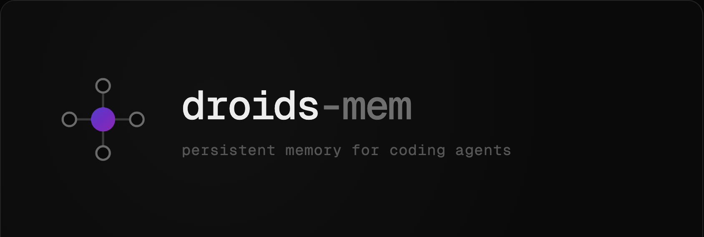
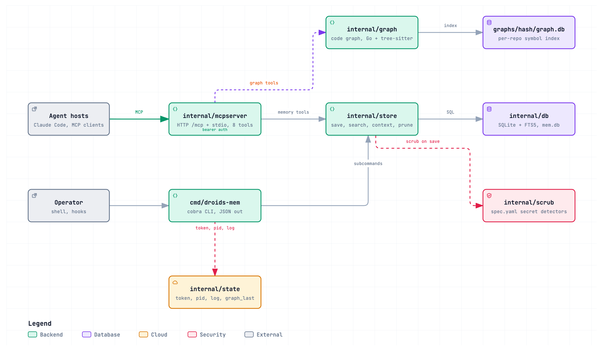
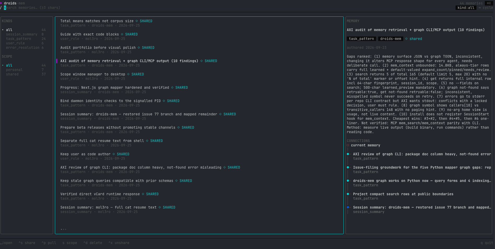

# droids-mem

droids-mem gives coding agents persistent local memory and a code graph from one
binary. Memories live in SQLite with FTS5; no vector database, API key, or
external service is required.

## Install

### Homebrew (macOS and Linux)

```sh
brew tap samuelmolero26/tap
brew install droids-mem
```

### Install script (macOS and Linux)

```sh
curl -fsSL https://raw.githubusercontent.com/SamuelMolero26/droids-mem/main/install.sh | sh
```

The script downloads the release for `darwin` or `linux` on `amd64` or `arm64`,
verifies its published SHA-256 checksum, and installs it to `/usr/local/bin` or
`~/.local/bin`. Set `DROIDS_MEM_VERSION` to a `v`-prefixed release tag or
`DROIDS_MEM_PREFIX` to another install directory.

Release binaries also carry SLSA provenance attestations:

```sh
gh attestation verify "$(command -v droids-mem)" --repo SamuelMolero26/droids-mem
```

## Connect an Agent

For Claude Code, install the lifecycle hooks, user-scoped MCP registration, and
managed guidance block:

```sh
droids-mem install --all
```

For Codex or OpenCode, register the MCP server with that host:

```sh
droids-mem install --host codex
droids-mem install --host opencode
```

These integrations use MCP over stdio. The host starts and stops the process, so
there is no daemon, port, or bearer token to manage.

## Quick Start

Use one stable, lowercase `task_type` for each project or workflow:

```sh
droids-mem save \
  --task-type example-project \
  --kind error_resolution \
  --title "Retry transient write locks" \
  --what "Concurrent writes returned SQLITE_BUSY" \
  --learned "Retry the write after a short backoff" \
  --tags "sqlite retry"

droids-mem search --query "database busy" --task-type example-project
droids-mem context --task-type example-project
droids-mem tui
```

The four memory kinds are `error_resolution`, `task_pattern`, `user_rule`, and
`session_summary`. Run `droids-mem <command> --help` for flags and examples.

## MCP Tools

| Tool | Purpose |
|---|---|
| `mem_save` | Validate, scrub, deduplicate, and persist a lesson |
| `mem_search` | Search memories with BM25 and token-overlap ranking |
| `mem_context` | Load a two-tier context bundle and mint a session ID |
| `mem_get` | Fetch one complete memory by ID |
| `mem_corpus` | Summarize task types, memory kinds, and recent sessions |
| `graph_symbol` | Return one symbol's source, callers, callees, and blast size |
| `graph_package` | List a package's exported surface as signatures |
| `graph_build_wait` | Wait for a repository graph to become fresh |

The graph tools require an absolute repository path. They are signatures-first:
neighboring symbols are compact stubs, while the requested symbol includes its
source.

## Code Graph

Query a package before drilling into a symbol or checking its callers:

```sh
droids-mem graph package internal/store --repo "$PWD"
droids-mem graph symbol Store.Save --repo "$PWD" --direction up --depth 3
```

| Languages | Precision | Meaning |
|---|---|---|
| Go | `resolved` | Type-checked call edges and resolved interface dispatch |
| Python, TypeScript, JavaScript | `syntactic` | Tree-sitter name resolution; callers and callees are approximate |

Read each response's `precision`, `hint`, and `freshness` before relying on it.
Mapper test files and notebooks are not indexed, so `transitive_callers` can
undercount. A `stale` graph serves the last complete index;
`carried` marks a unit whose prior edges were retained. Verify critical findings
against source when either appears.

## Architecture



Agents reach the memory store and code graph through the MCP bridge; operators
use the CLI. Both share `internal/store`, which scrubs before writing to
SQLite. The code graph keeps its own per-repo index and never touches `mem.db`.

## Data and Safety

The default database is `~/.droids-mem/mem.db`; set `DROIDS_MEM_DB` to move it.
Memories default to `personal`. Sharing requires an explicit publish action in
the TUI, which writes selected memories to a git-tracked pool. A teammate who
already pulled a published copy keeps it even if the source is later unshared.

Before storage, droids-mem redacts supported secrets and PII from `title`,
`what`, and `learned`. Matching tags and identifiers are rejected rather than
silently rewritten. Exact and near-duplicate saves are skipped unless the caller
explicitly forces a correction.

## TUI

```sh
droids-mem tui
```


## Operations

```sh
droids-mem doctor             # Check and repair the memory index
droids-mem upgrade            # Upgrade a non-Homebrew installation
brew upgrade droids-mem       # Upgrade a Homebrew installation
droids-mem serve --help       # Manual HTTP or stdio MCP operation
droids-mem --help             # Complete command list
```

## License

[MIT](LICENSE). See [CHANGELOG.md](CHANGELOG.md) for release history and the
[Releases page](https://github.com/SamuelMolero26/droids-mem/releases) for
prebuilt binaries.
